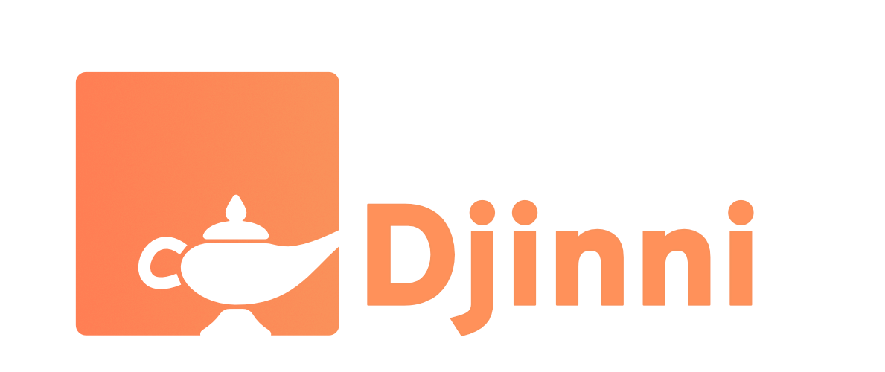

# Djinni Logo Resources

The **cross-language-cpp** Djinni has a new, unique logo. If you want to report about or reference to our Project, please make sure to use the official Logo resources:

- **Icon** (720x720): 
    
- **Full Logo** (1189 x 500): 
    
- [Affinity Designer Resource file](assets/resources/djinni_icon.afdesign)
