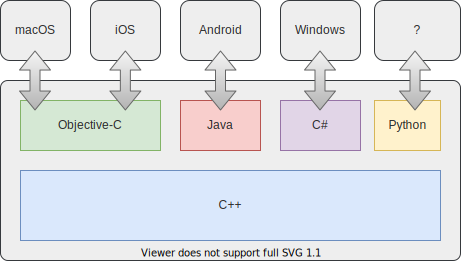

## :clap: Simple IDL

The Djinni [**Interface Definition Language**](djinni-generator/idl.md) provides a simple, yet powerful way to design your interfaces.

---

## :electric_plug: IDE Integration

Plugins for Djinni are available for [**IntelliJ IDEA**](djinni-intellij-plugin/index.md) & [**VS Code**](vscode-djinni/index.md)

---

## :rocket: Blurs the Line Between Languages

With Djinni you can implement interfaces in any target language and call the implementation from C++!

---

## :boom: Can Target any Operating System

Djinni comes with support for native app development on every popular OS:

---

## :earth_americas: Maintained by a Small, but Active Community

Djinni was originally developed by Dropbox in 2014. 
Since June 2020 it is independently maintained by a small group of individuals from all over the globe.

Get in contact with us on the [Mobile C++ Slack](https://mobilecpp.slack.com/)! :blush:

 
 
